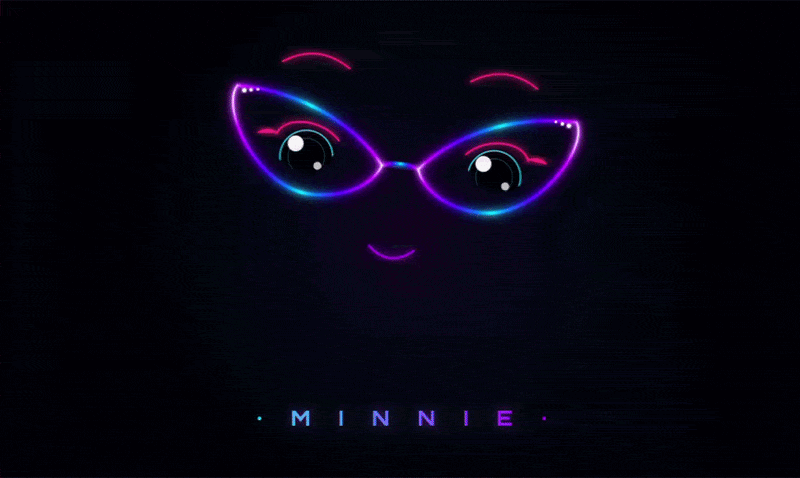

# hermes-embodiment

**Give your Hermes agent a body — an animated face, a living RGB presence, and mood, all driven by the agent's real state.**

[](LICENSE) [](https://github.com/webdevtodayjason) [](https://www.raspberrypi.com/) [](https://www.python.org/) [](https://github.com/webdevtodayjason/hermes-embodiment/pulls)



---

## What it is

`hermes-embodiment` is the **embodiment layer** for [Hermes Agent](#credits). It takes the agent's *real* per-turn state — thinking, calling a tool, speaking — and renders it as a physical presence:

- an **animated face** on a screen (a browser, or a kiosk display),
- **case RGB LEDs** that change color with the agent's state,
- a **voice** that speaks the agent's replies,
- and a **status wordmark** that shows what the agent is actually doing right now ("searching the web…").

None of this is faked or scripted. The plugin registers Hermes lifecycle hooks (`pre_llm_call`, `pre_tool_call`, `post_llm_call`, …) and fans each transition out over Server-Sent Events to the face and to any attached hardware. When the agent starts thinking, the eyes look up and the LEDs go amber. When it calls `web_search`, the wordmark reads "searching the web…". When it answers, it speaks and the aura pulses green.

**Minnie** is the flagship example persona — a feminine, intelligent, cyberpunk face with cat-eye glasses (think Evy, the librarian). She's just *config*: the plugin code is fully generic and persona-agnostic, so you can point it at any persona, voice, and theme. Minnie ships as `examples/minnie/config.yaml` so you have a complete, opinionated showcase to copy from.

It runs anywhere Hermes runs (the face is a self-contained web app in a browser, audio on the default sink), and it fully lights up on a SunFounder **Pironman 5 (Pro MAX)** Raspberry Pi — RGB case LEDs over SPI plus a DSI touchscreen kiosk.

## Features

- **Animated cat-eye SVG face** — 16 expressions (idle, listening, thinking, speaking, alert, sleeping + 10 emotional moods), randomized blinking and eye-darts, spring-damper head physics, themed particle aura, and a state-agnostic mouth. Vanilla HTML/CSS/SVG/JS + Canvas — no framework, no build step.
- **Live status wordmark** — the persona's nameplate doubles as an activity line. While the agent works, it shows the *friendly* name of the tool in flight ("searching the web…", "running code…", "working with files…"), then falls back to the persona name when idle.
- **Case LEDs synced to state** — 18× WS2812 RGB driven directly over SPI (`spidev0.0`), color-and-style per state. Auto-detected and fully optional: present on a Pironman, inert everywhere else — it never raises into the agent.
- **Two-way streaming voice** — speaks the agent's replies through ElevenLabs (or whatever TTS Hermes is configured with), **streaming** so she starts talking within a few hundred ms, with the **mouth driven by her real audio** (per-chunk RMS over the SSE stream). Markdown is stripped so she never reads syntax aloud, and a new reply **preempts** the previous one so two responses never double up.
- **Push-to-talk + barge-in** — hold the on-screen mic (or a floating button) to talk; audio is transcribed by a **local Whisper** and injected back to the agent. Pressing the mic again **interrupts her mid-sentence** so you can jump in.
- **Touch control panel** — a translucent tap-to-open overlay for brightness, volume, **mic gain**, and push-to-talk that lets her face show through behind it, plus a guarded **power-off** flow (confirm modal → graceful shutdown).
- **Live mic tuning** — a real-time input-level **VU meter** (green → amber → red, with a clip latch) plus a **capture-gain slider** on the touch panel, fed by per-block RMS/peak over the same SSE stream. Dial the mic in *visually* — no SSH, no guesswork — so push-to-talk and STT get a clean signal.
- **Touch reactions** — poke her face (nose, forehead, cheeks, glasses, eyes) and she reacts — a quick expression change plus an LED flourish.
- **Mood layer** — her reply's sentiment is inferred into one of **9 moods**; the face *and* the case LEDs settle on that mood at rest, so her body reflects how she feels.
- **Memory** — an optional Hermes memory provider gives her real cross-session recall. The Minnie showcase uses **`holographic`** (local SQLite + FTS5 + HRR — no cloud, no server), so she grows with you over time.
- **Config-driven personas** — persona, wake word, voice, audio device, face theme, and LED palette all live in `config.yaml`. Every key has a built-in default, so a bare box still runs as "face-in-a-browser + TTS".
- **Fully offline kiosk** — no CDN, no fonts to fetch, no network at render time. Ships as static files served by the plugin itself.
- **~60fps** — hardware-accelerated Canvas + SVG, tuned for a small kiosk display.

## Install

**Primary (recommended):** install straight from GitHub through Hermes' plugin manager:

```bash
hermes plugins install webdevtodayjason/hermes-embodiment --enable
```

That fetches the plugin, prompts for any required env (`ELEVENLABS_API_KEY`), and enables it. Restart your gateway and open the face at <http://127.0.0.1:8830/>.

**Dev / local:** clone the repo and run the installer to symlink or copy it into your Hermes plugins dir:

```bash
git clone https://github.com/webdevtodayjason/hermes-embodiment.git
cd hermes-embodiment
./install.sh            # copy into ~/.hermes/plugins/embody/ + seed generic config
./install.sh --minnie   # ...seed the Minnie showcase config instead
./install.sh --link     # ...symlink instead of copy (live edits)
```

`install.sh` honors `$HERMES_HOME` (default `~/.hermes`), never clobbers an existing active `config.yaml`, and prints the next steps (`hermes plugins enable embody`, then restart the gateway).

## Configure

All behavior is read from `config.yaml`, with a built-in default for every key. Start from `config.yaml.example` (generic) or `examples/minnie/config.yaml` (the showcase). The shape:

```yaml
persona:
  name: "Assistant"            # face nameplate + page title
  wake_word: "hey assistant"   # reserved for a future STT wave

voice:
  enabled: true
  provider: ""                 # "" => inherit Hermes' TTS provider (e.g. elevenlabs)
  voice_id: ""                 # "" => inherit Hermes' configured voice
  speak_on: "post_llm_call"

audio:
  backend: "auto"              # auto | pipewire | alsa | hermes-default | off
  device: ""                   # "" => system default sink; or pin a PipeWire/ALSA device

face:
  enabled: true
  host: "127.0.0.1"
  port: 8830
  theme: "default"             # the face-ui applies data-theme=<theme> (e.g. "minnie")
  kiosk:
    enabled: false             # true => launch a dedicated kiosk browser at the face URL

leds:
  backend: "auto"              # auto (active iff a Pironman is detected) | pironman | off
  brightness: 60               # 0-100 global default; per-state may override
  states:                      # state -> { color: <6-hex, no #>, style: solid|breathing|flow }
    idle:     { color: "1E3A5F", style: "breathing" }
    thinking: { color: "FFB000", style: "flow" }
    working:  { color: "8000FF", style: "solid" }
    speaking: { color: "00C853", style: "flow" }
```

See **[`examples/minnie/config.yaml`](examples/minnie/config.yaml)** for a complete annotated instance (HDMI audio pinned by sink name, Pironman LEDs, kiosk on).

`ELEVENLABS_API_KEY` (declared in `plugin.yaml`) drives the voice. If it's unset, the face and LEDs still run and speech falls back to Hermes' own configured TTS.

## Hardware

**Runs anywhere.** With no special hardware, you get the animated face in any browser plus audio on the default sink. The LED backend auto-detects as absent and no-ops; nothing to configure.

**Full embodiment on the Pironman 5 Pro MAX.** On a SunFounder Pironman 5 (Pro MAX) Raspberry Pi, the plugin lights up completely:

- **18× WS2812 case LEDs** driven directly over `spidev0.0` (instant, no CLI shell-out, no service restart),
- a **4.3" DSI touchscreen** running the face as a fullscreen kiosk,
- HDMI / 3.5mm audio out for the voice.

The LED backend is active only when `/dev/spidev0.0` is writable (your user is in the `spi` group) and the `neopixel_spi` / `board` Blinka driver imports. Otherwise it stays inert.

> **⚠️ Pironman LED handoff — important.** Two processes can't both own the SPI bus. To let `embody` drive the case LEDs, pironman5 must release them: remove `"ws2812"` from the **Pro MAX variant's `PERIPHERALS`** list so pironman5's own `WS2812Addon` never opens `/dev/spidev0.0`. (OLED, fans, and the dashboard are unaffected.)
>
> **A `pironman5` package upgrade restores pironman's own RGB control** by reinstating that list — so after any pironman5 upgrade, **re-apply the one-line `"ws2812"` removal** or you'll get two processes fighting over the bus.

## 🛠️ Build Your Own Minnie

Want the full physical Minnie — animated face on a touchscreen, RGB case synced to state, and a voice? She runs on a **Raspberry Pi 5** in a **SunFounder Pironman 5 Pro Max** case. The short BOM:

| Part | Notes |
|---|---|
| Raspberry Pi 5 (8GB / 16GB) | the brain |
| **SunFounder Pironman 5 Pro Max** (w/ touchscreen) | her body — WS2812 RGB, OLED, 4.3" DSI screen, speakers, camera, dual-NVMe ([buy](https://a.co/d/09DaQDy9)) |
| NVMe M.2 SSD | OS / boot drive |
| 27W USB-C PD power supply | headroom for NVMe + accessories |
| microSD card | initial OS flash |
| USB mic · M5StickC Plus · ElevenLabs key | *optional* (voice / companion) |

**→ Full step-by-step hardware guide: [`docs/BUILD.md`](docs/BUILD.md)** — assembly, OS, pironman5 software, kiosk autostart, the LED handoff, and the audio jumper.

## Architecture

```
Hermes agent hooks                 embody                         surfaces
──────────────────                 ──────                         ────────
on_session_start  ─┐
pre_llm_call       │   set_state(state, status)
pre_tool_call      ├──────────────►  core.state  ──SSE /events──► face web app (browser/kiosk)
post_tool_call     │   (daemon-thread HTTP server, :8830)         │
post_llm_call      │                    │                         └─► /config  (persona, theme)
on_session_end    ─┘                    │
                                        └──► backends.*  ──────────► WS2812 LEDs (SPI), null, …
post_llm_call ──► core.voice ──► backends.audio ──────────────────► TTS + audio out (HDMI/sink)
```

- **State server** (`core/state.py`) — a daemon-thread HTTP server on `:8830`, deliberately isolated from the gateway's asyncio loop. Serves the face app, an SSE `/events` stream, `/state.json`, and `/config`.
- **Hooks** (`__init__.py`) — map agent lifecycle to states: `pre_llm_call → thinking`, `pre_tool_call → working` (with a friendly tool label), `post_llm_call → speaking` then `idle`, etc.
- **Backends** (`backends/`) — a tiny module-interface (`is_available` / `setup` / `on_state`) with auto-detection. `leds_pironman` drives WS2812 over SPI; `null` is the universal no-op fallback; `audio` is transport (it has `play()`, not `on_state`). Backends are best-effort — a flaky write can never crash a hook.
- **Face web app** (`face/`) — a self-contained, offline HTML/CSS/SVG/JS + Canvas kiosk. Connects to `/events` for live state and reads persona/theme from `/config`. Supports `?state=<name>` for offline preview.

## The Minnie example

Minnie is the showcase persona: a warm, intelligent, English-librarian character behind a neon cyberpunk cat-eye visor. Everything that makes her *Minnie* — the name, the British voice, the `minnie` face theme, the HDMI audio pin, the Pironman LEDs, the kiosk — is config in **[`examples/minnie/config.yaml`](examples/minnie/config.yaml)**. Copy it to your active `config.yaml` (or run `./install.sh --minnie`) to bring her up, then swap the values to make the persona your own.

## Preview the face

You can render the face offline without Hermes — handy for theming or screenshots:

```bash
cd face
python3 -m http.server 8907
# open http://127.0.0.1:8907/?state=idle   (also: thinking, speaking, listening, …)
```

## Credits

- Built on **[Hermes Agent](https://github.com/webdevtodayjason)** — the agent runtime whose lifecycle hooks and TTS this plugin embodies.
- The **Minnie** face design was iterated with **Gemini Antigravity**.
- By **Jason Brashear** / **Titanium Computing**.

## License

[MIT](LICENSE) © 2026 Jason Brashear (Titanium Computing).

---

<div align="center">

**Built by [Jason Brashear](https://jasonbrashear.com) · Titanium Computing**

🌐 [jasonbrashear.com](https://jasonbrashear.com)  ·  ✍️ [Substack](https://jasonbrashear.substack.com/)

</div>
